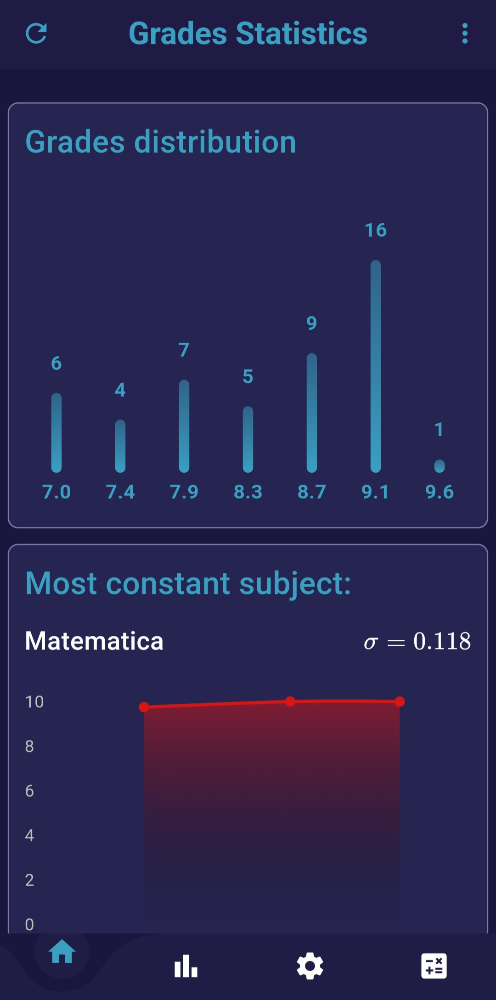

# Grades-App

A multi-platform app built to visualize statistics on a set of grades saved as a JSON file remotely.

> [!NOTE]
> The app was thought to be paired with [this grades API](https://github.com/Zarrh/Grades_API), which automates the generation of the JSON file

## Remote grades file link

The remote link to the JSON file containing the grades is meant to be put in the following variable inside links.dart

```
class Links {
  static const url = "LinkToJSONFile";
}
```

## Homepage

The homepage contains some graphs about the distributions of the grades and their history. The home also provides the best scored subject and the most constant one.

<p align="center">
  
  
</p>

## Stats page and prediction

The stats page allows to view a detailed list of all the grades and see a graph showing the progress in time. It is also possible to integrate an algorithm for the prediction of the final grade. The default one, though, is a simple approximation to the nearest integer, with some relevance given to the final grades of the past years.

<p align="center">
  
  
  
</p>

## Calculator

The app also contains a page to quickly compute an average of a set of grades inserted by the user.

<p align="center">
  
</p>